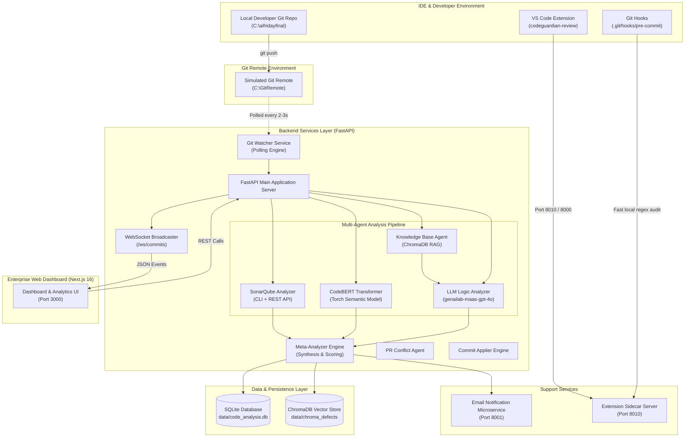

# Enterprise Code Analysis & Developer Intelligence Platform
## Document of Complete Understanding

**Author:** Staff / Principal Software Engineer  
**Date:** August 8, 2026  
**Scope:** Full Repository (`c:\aifridayfinal`) — Subsystems: `BE/`, `chatbot/`, `enterprise-app/`, `vscode-extension/`

---

## 1. Executive Summary & Core Platform Purpose

The **Enterprise Code Analysis & Developer Intelligence Platform ("CodeGuardian")** is an AI-native ecosystem engineered to deliver real-time, multi-agent code analysis, automated security/quality audits, developer productivity scoring, and seamless developer tools integration across the entire Software Development Lifecycle (SDLC).

### Primary Capabilities
1. **Real-time Commit Monitoring**: Background Git repository watcher (`GitWatcher`) polling commits and emitting instant WebSocket updates.
2. **Multi-Agent Orchestration Pipeline**:
   - **Static Analysis Engine**: SonarQube / SonarCloud REST integration.
   - **Semantic Anomaly Detector**: PyTorch CodeBERT model for token-level code smell identification.
   - **RAG Knowledge Base Agent**: Vector-backed contextual codebase rules and guidelines retrieval.
   - **LLM Code Logic Analyzer**: Deep multi-rule reasoning evaluating SOLID principles, performance, security, and exception handling.
   - **Meta-Analyzer Engine**: Synthesis engine deduplicating findings, computing 0–100 composite scores, and producing executive summaries.
3. **Developer Intelligence Scoring**: Multi-dimensional scoring (Quality, Consistency, Security, Learning Velocity) tracking developer performance over time.
4. **Developer Interfaces**:
   - **VS Code Extension (`codeguardian-review`)**: IDE integration with pre-commit/pre-push hooks, inline CodeLens quick-fixes, diff viewers, and an AI chat assistant.
   - **Enterprise Next.js Web App (`enterprise-app`)**: Command center featuring real-time commit streams, PR analysis, leaderboards, and code review management.
   - **Offline Knowledge Extraction Pipeline (`chatbot`)**: Autonomous agent producing grounded RAG artifacts (`knowledge_base.md`).

---

## 2. Technology Stack Matrix

| Subsystem | Tech Stack & Frameworks | Key Dependencies | Primary Role |
| :--- | :--- | :--- | :--- |
| **Backend Core (`BE/app`)** | Python 3.10+, FastAPI, Asyncio, SQLAlchemy | `fastapi`, `sqlalchemy`, `pydantic`, `langchain`, `litellm`, `torch`, `transformers` | Central API server, DB management, WebSocket manager, Agent orchestrator |
| **Extension Sidecar (`BE/extensionService`)** | FastAPI, Uvicorn | `fastapi`, `httpx`, `litellm` | Lightweight local IDE backend on port 8010 |
| **Notification Service (`BE/emailService`)** | FastAPI, SMTP | `fastapi`, `jinja2`, `python-dotenv` | Async transactional email dispatcher on port 8001 |
| **Knowledge Pipeline (`chatbot/`)** | Python 3.10+, LangChain, ThreadPoolExecutor | `langchain-openai`, `chromadb`, `python-dotenv`, `httpx` | Offline codebase parsing & RAG markdown generator |
| **Web Frontend (`enterprise-app/`)** | Next.js 16, React 19, TypeScript, Tailwind v4, Fluent UI | `@fluentui/react-components`, `lucide-react`, `clsx`, `tailwind-merge` | Enterprise web dashboard, PR reviewer, real-time analytics UI |
| **VS Code Extension (`vscode-extension/`)** | TypeScript, Node.js, VS Code API | `vscode`, `child_process`, `httpx` | IDE sidebar, inline quick-fixes, local regex scanner, Git hooks installer |

---

## 3. High-Level System Architecture



---

## 4. Subsystem Deep-Dive & File Structure

### A. Backend Services (`BE/`)

#### 1. Core Server & Orchestration (`BE/app/`)
- [`main.py`](file:///c:/aifridayfinal/BE/app/main.py): Server entry point. Runs FastAPI lifespan, seeds baseline database records (users `admin`, `dev1`, `dev2`, `dev3`, default project, SonarConfig), manages WebSocket connections (`ConnectionManager`), and orchestrates parallel agent execution upon commit detection.
- [`git_watcher.py`](file:///c:/aifridayfinal/BE/app/git_watcher.py): Asynchronous Git repository monitor. Uses `git log` and `git diff` via subprocesses to inspect watched repos, parse diffs, count insertions/deletions, and invoke pipeline callbacks.
- [`database.py`](file:///c:/aifridayfinal/BE/app/database.py): Configures SQLAlchemy engine over `data/code_analysis.db` with thread-safe session factories (`SessionLocal`).
- [`models.py`](file:///c:/aifridayfinal/BE/app/models.py): Defines ORM schemas (`User`, `Project`, `Commit`, `CodeReview`, `ReviewFeedback`, `DeveloperScore`, `SonarConfig`, `AnalysisSummary`, `PullRequest`).
- [`auth.py`](file:///c:/aifridayfinal/BE/app/auth.py): JWT token issuing (`create_access_token`), verification, bcrypt password hashing, and role-based access control (`require_role("admin")`).

#### 2. Analysis Pipeline Agents (`BE/app/`)
- [`sonar_analyzer.py`](file:///c:/aifridayfinal/BE/app/sonar_analyzer.py): Executes local `sonar-scanner` executable, polls SonarQube REST API (`http://localhost:9008/api/issues/search`), extracts rule details, and maps severity to system standard.
- [`codebert_agent.py`](file:///c:/aifridayfinal/BE/app/codebert_agent.py): Initializes transformer tokenizers and models (`microsoft/codebert-base`) to perform semantic AST anomaly detection on changed diff chunks.
- [`knowledge_base_agent.py`](file:///c:/aifridayfinal/BE/app/knowledge_base_agent.py) & [`rag.py`](file:///c:/aifridayfinal/BE/app/rag.py): RAG pipeline querying ChromaDB code embeddings to inject architectural context into LLM prompts.
- [`code_logic_analyzer.py`](file:///c:/aifridayfinal/BE/app/code_logic_analyzer.py): Evaluates diffs against 10 explicit software engineering rules (SOLID, DRY, security, logging, error handling) using `genailab-maas-gpt-4o`.
- [`meta_analyzer.py`](file:///c:/aifridayfinal/BE/app/meta_analyzer.py): Master synthesizer. Combines findings from SonarQube, CodeBERT, and LLM Logic Analyzer, removes duplicate findings, computes sub-scores (maintainability, reliability, security, performance), and outputs executive summaries.
- [`pr_agent.py`](file:///c:/aifridayfinal/BE/app/pr_agent.py): Analyzes Git branch diffs for Pull Requests, identifies merge conflicts, and generates resolution suggestions.
- [`commit_applier.py`](file:///c:/aifridayfinal/BE/app/commit_applier.py): Applies accepted AI code suggestions back to the physical source files and creates automated git patch commits.
- [`notifications.py`](file:///c:/aifridayfinal/BE/app/notifications.py): Sends Webhook/Slack alerts and triggers the external Email Microservice upon analysis completion.

#### 3. Gateway & Microservices
- `BE/gateway/`: Modular proxy layer containing JWT validation (`auth.py`), guardrails rejecting off-topic/healthcare queries (`guardrails.py`), and rate limiting (`rate_limiter.py`).
- `BE/extensionService/main.py`: Dedicated FastAPI sidecar running on port 8010, servicing the VS Code extension for instant linting, explainers, and AI chat.
- `BE/emailService/`: Independent FastAPI microservice running on port 8001, rendering Jinja2 email templates for code review summaries.

---

### B. VS Code Extension (`vscode-extension/`)

- [`package.json`](file:///c:/aifridayfinal/vscode-extension/package.json): Defines extension contributions, commands (`codeguardian.analyzeStaged`, `codeguardian.explainSelection`), sidebar tree views (`reviewTree`, `findingsTree`, `historyTree`), and settings.
- [`src/extension.ts`](file:///c:/aifridayfinal/vscode-extension/src/extension.ts): Main extension entry point. Initializes file system watchers on `.git/HEAD` and `.git/index`, registers providers, and binds extension commands.
- [`src/beClient.ts`](file:///c:/aifridayfinal/vscode-extension/src/beClient.ts): Communication layer with backend sidecar (port 8010) with automatic failover port probing (8015, 8000, 8080).
- [`src/analyzer.ts`](file:///c:/aifridayfinal/vscode-extension/src/analyzer.ts): Fast local regex AST engine detecting high-confidence issues (hardcoded credentials, raw SQL strings, dangerous innerHTML) directly inside the IDE.
- [`src/hookInstaller.ts`](file:///c:/aifridayfinal/vscode-extension/src/hookInstaller.ts): Generates and writes executable `pre-commit` and `pre-push` shell scripts into `.git/hooks/`.
- [`src/views/chatViewProvider.ts`](file:///c:/aifridayfinal/vscode-extension/src/views/chatViewProvider.ts): Webview provider delivering an interactive AI assistant inside the VS Code sidebar.
- [`src/views/reviewStudioPanel.ts`](file:///c:/aifridayfinal/vscode-extension/src/views/reviewStudioPanel.ts): Full-screen Webview panel providing an interactive code audit studio for accepting/rejecting AI suggestions.

---

### C. Chatbot Knowledge Agent (`chatbot/`)

- [`main.py`](file:///c:/aifridayfinal/chatbot/main.py): CLI engine discovering codebase source files, executing parallel threads for extraction and formatting, and writing `knowledge_base.md`.
- [`extractor_agent.py`](file:///c:/aifridayfinal/chatbot/extractor_agent.py): Formulates structured JSON prompts (`FileKnowledge`) instructing LLM to parse code structures and mandate exact line range citations (`file:L10-L25`).
- [`formatter_agent.py`](file:///c:/aifridayfinal/chatbot/formatter_agent.py): Groups JSON extraction payloads into batches (<50,000 chars) and stream-synthesizes a cross-referenced Markdown knowledge base.
- [`knowledge_types.py`](file:///c:/aifridayfinal/chatbot/knowledge_types.py): Strictly typed Python dataclass definition for extracted code knowledge.

---

### D. Enterprise Web Application (`enterprise-app/`)

- `app/layout.tsx`: Root application shell embedding `FluentThemeProvider` and `AuthProvider`.
- `app/dashboard/page.tsx`: System dashboard featuring real-time WebSocket connection to `/ws/commits`, animated agent pipeline steps (`AgentPipeline`), quality scorecards, and recent commit lists.
- `app/commits/page.tsx`: Commit history browser with side-by-side Git diff viewer and detailed AI review findings.
- `app/reviews/page.tsx`: Action studio allowing lead developers to accept/reject AI suggestions and apply changes to the repository.
- `app/pull-request/page.tsx`: PR comparison dashboard displaying AI conflict analysis and branch diffs.
- `app/leaderboard/page.tsx`: Gamified developer rankings showing composite quality, security, and velocity metrics.

---

## 5. Database Schema & Data Models

The SQLite database (`BE/data/code_analysis.db`) contains 9 core tables:

```mermaid
erDiagram
    User ||--o{ DeveloperScore : "has scores"
    User ||--o{ ReviewFeedback : "submits"
    Project ||--o{ Commit : "contains"
    Project ||--o{ SonarConfig : "configured with"
    Commit ||--o{ CodeReview : "generates"
    Commit ||--o| AnalysisSummary : "summarized by"
    CodeReview ||--o{ ReviewFeedback : "receives feedback"

    User {
        int id PK
        string username UK
        string email UK
        string password_hash
        string full_name
        string role
        boolean is_active
        datetime created_at
    }

    Project {
        int id PK
        string name
        string repo_path
        string description
        boolean is_active
        string last_watched_commit
        datetime created_at
    }

    Commit {
        int id PK
        string hash UK
        string author_name
        string author_email
        string message
        datetime timestamp
        int project_id FK
        int files_changed
        int insertions
        int deletions
        string analysis_status
        text diff_content
        datetime created_at
    }

    CodeReview {
        int id PK
        int commit_id FK
        string agent_type
        string severity
        string file_path
        int line_start
        int line_end
        string category
        string title
        text message
        text suggestion
        text original_code
        text suggested_code
        string status
        float confidence
        datetime created_at
    }

    AnalysisSummary {
        int id PK
        int commit_id FK UK
        float composite_score
        float maintainability_score
        float reliability_score
        float security_score
        float performance_score
        float guideline_score
        text executive_summary
        text key_issues
        text recommendations
        int total_findings
        int sonar_findings
        int logic_findings
        int kb_insights
        datetime updated_at
    }

    DeveloperScore {
        int id PK
        int user_id FK
        int project_id FK
        float code_quality_score
        float consistency_score
        float security_score
        float learning_velocity
        float overall_rating
        int total_commits
        int total_issues
        datetime updated_at
    }

    ReviewFeedback {
        int id PK
        int review_id FK
        int user_id FK
        string action
        string rule_category
        text reason
        string pattern_signature
        datetime created_at
    }

    SonarConfig {
        int id PK
        int project_id FK
        string sonar_host
        string sonar_token
        string sonar_project_key
        boolean is_active
        datetime created_at
    }

    PullRequest {
        int id PK
        string source_branch
        string destination_branch
        string status
        string created_by
        text ai_summary
        text ai_conflicts
        text ai_recommendations
        text changed_files
        int files_changed
        int insertions
        int deletions
        boolean has_conflicts
        text admin_comment
        string reviewed_by
        datetime reviewed_at
        datetime created_at
    }
```

---

## 6. End-to-End Execution Lifecycles

### A. Full Real-Time Commit Analysis Flow

```
[Developer executes: git push]
              │
              ▼
[Git Remote (C:\GitRemote) receives commit]
              │
              ▼
[GitWatcher Polling Loop (BE/app/git_watcher.py)]
  ├── Detects new commit hash != last_watched_commit
  ├── Extracts git log metadata & diff content via subprocess
  └── Inserts row into `commits` table (status = PENDING)
              │
              ▼
[WebSocket Broadcast (ws_manager.broadcast)]
  └── Sends JSON event `commit_detected` to Web App & VS Code Extension
              │
              ▼
[Parallel Analysis Execution (BE/app/main.py lifespan callback)]
  ├── Task 1: Knowledge Base Agent (`knowledge_base_agent.py`) -> Retrieves ChromaDB context
  ├── Task 2: SonarQube Scanner (`sonar_analyzer.py`) -> Runs `sonar-scanner` & fetches REST issues
  ├── Task 3: CodeBERT Analyzer (`codebert_agent.py`) -> Performs semantic token analysis
  └── Task 4: LLM Logic Analyzer (`code_logic_analyzer.py`) -> Evaluates 10 engineering guidelines
              │
              ▼
[Synthesis Engine (`meta_analyzer.py`)]
  ├── Merges findings from all 4 tasks
  ├── Deduplicates identical line findings
  ├── Evaluates 0–100 sub-scores (Maintainability, Security, Reliability)
  ├── Requests LLM Executive Summary & Recommendations
  └── Persists `code_reviews` and `analysis_summaries` rows
              │
              ▼
[Completion & Notification]
  ├── Update Commit status = COMPLETED
  ├── Broadcast `analysis_complete` WebSocket message to UI
  ├── Dispatch Slack alert & trigger Email Microservice (port 8001)
  └── Update `developer_scores` metrics for author
```

---

## 7. Technical Debt, High-Risk Vulnerabilities & Architectural Blockers

> [!CAUTION]
> ### 1. Missing Web App Client Libraries (Critical Build Blocker)
> The Next.js web application (`enterprise-app`) is currently unable to build (`npm run build`) because `lib/types.ts` and `lib/api-client.ts` are completely missing from the filesystem despite being imported across all page routes.

> [!WARNING]
> ### 2. Insecure Credential & Session Management
> - Hardcoded API keys (`sk-gvEmPsuh15hW9dkg-CF8mQ`) and JWT secrets (`friday-hackathon-secret-key-2024`) are present in `BE/config.py` and `BE/app/auth.py`.
> - `enterprise-app/components/providers/auth-provider.tsx` stores JWT tokens in `localStorage`, exposing authentication tokens to potential Cross-Site Scripting (XSS) attacks.
> - VS Code extension stores `codeguardian.apiKey` in standard clear-text `settings.json` instead of using `vscode.SecretStorage`.

> [!WARNING]
> ### 3. Disabled SSL Verification
> `BE/config.py` and `chatbot/config.py` explicitly disable SSL validation (`PYTHONHTTPSVERIFY = '0'`, `ssl._create_unverified_context`). This configuration must be strictly gated to local development environments to avoid Man-In-The-Middle (MITM) vulnerabilities in production.

> [!NOTE]
> ### 4. Frontend Rendering Optimization Opportunities
> All pages in `enterprise-app` currently use `"use client"` directives with manual client-side `useEffect` data fetching and hardcoded `http://localhost:8000` URLs. Refactoring towards Next.js Server Components (RSC) and centralized API routes will improve load performance and security.

---

## 8. Summary of Action Plan

1. **Restore Web App Build**: Implement `enterprise-app/lib/types.ts` and `enterprise-app/lib/api-client.ts` with complete type definitions and REST helpers.
2. **Add SonarQube Resilience**: Update `BE/app/sonar_analyzer.py` with non-blocking error handling and connection checks for local execution when SonarQube is offline.
3. **Environment Hardening**: Extract hardcoded credentials to `.env` files across services.
