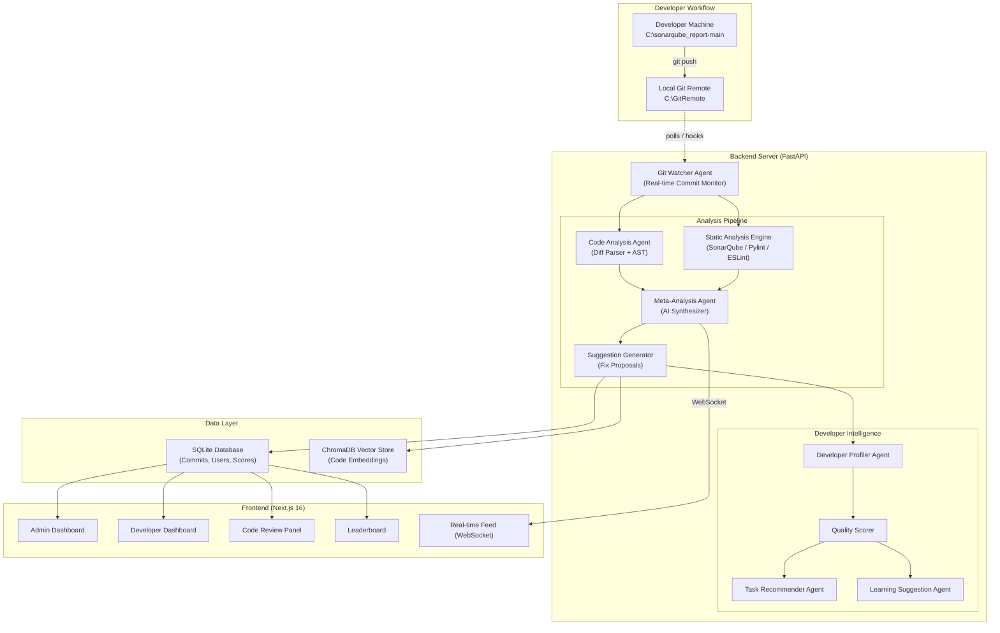
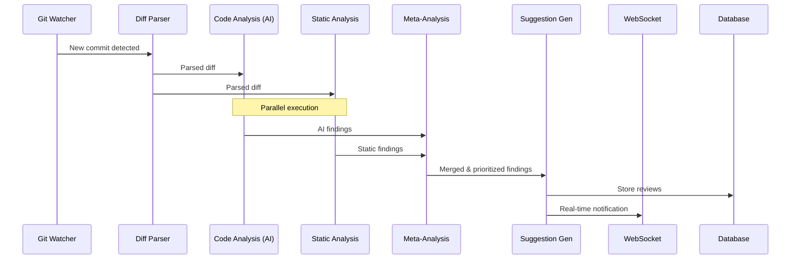

# Enterprise Code Analysis & Developer Intelligence Platform

An AI-powered multi-agent system that monitors Git commits in real-time, performs automated code reviews using AI agents + SonarQube analysis, provides developer intelligence scoring, and delivers enterprise-grade security through an AI Gateway.

## Current State Assessment

The existing codebase at `C:\EnterpriseCodeAnalysisApp\aifridayfinal` has:
- **Backend** ([BE/](file:///c:/EnterpriseCodeAnalysisApp/aifridayfinal/BE)): A Python FastAPI app with a multi-agent RAG pipeline, Flask-based AI Gateway (auth, guardrails, rate limiting), ChromaDB vector store
- **Frontend** ([enterprise-app/](file:///c:/EnterpriseCodeAnalysisApp/aifridayfinal/enterprise-app)): A fresh Next.js 16 + React 19 + Tailwind CSS v4 scaffold (no custom UI yet)
- **Git**: 3 commits on `origin` (GitHub), git binary at `C:\Users\GenAITVMSEZUSR4\AppData\Local\Programs\Git\cmd\git.exe`
- **Simulated Environment**: `C:\GitRemote` = simulated bare git remote, `C:\sonarqube_report-main` = simulated developer project

> [!IMPORTANT]
> The existing backend code is a RAG document Q&A system from a previous hackathon (textile defect detection). We will **repurpose the architecture** (multi-agent framework, gateway, auth) but **rebuild the agents and endpoints** for code analysis.

---

## User Review Required

> [!WARNING]
> **AI Gateway API Key**: The existing config uses `genailab-maas-gpt-4o` via `https://genailab.tcs.in`. Please confirm:
> 1. Is this API key and endpoint still valid for this hackathon?
> 2. Should we use the same LLM model (`genailab-maas-gpt-4o`) for code analysis agents?

> [!IMPORTANT]
> **SonarQube**: You mentioned SonarQube for parallel analysis. Should we:
> - A) Install and run SonarQube locally (requires Java 17+ and ~2GB RAM), OR
> - B) Simulate SonarQube analysis using a custom Python-based static analysis engine (using `pylint`, `flake8`, `bandit` for Python; `eslint` for JS/TS) — this is faster to set up and demo-friendly?

> [!IMPORTANT]
> **Project Scope for First Iteration**: Given hackathon constraints, I recommend building Phase 1 first (Git watcher + commit analysis + basic UI) and iterating. Confirm if you want the full system built at once or in phases.

---

## Open Questions

1. **Authentication Provider**: Should we keep the existing JWT + mTLS auth system, or do you want integration with a specific identity provider (e.g., Azure AD, LDAP)?
2. **Database**: The current setup uses SQLite. Should we stick with SQLite for the hackathon, or migrate to PostgreSQL?
3. **SonarQube Instance**: Do you already have SonarQube installed, or should we set it up fresh?
4. **Developer Profiles**: Should developer data be pre-seeded (synthetic), or should the system build profiles purely from commit history?

---

## System Architecture Overview



---

## Proposed Changes

### Phase 1: Git Infrastructure & Real-Time Commit Monitoring

---

#### Component: Git Watcher Service

This is the core real-time engine that polls the local git remote for new commits and triggers the analysis pipeline.

##### [NEW] [git_watcher.py](file:///c:/EnterpriseCodeAnalysisApp/aifridayfinal/BE/app/git_watcher.py)

A background thread/asyncio task that:
- Polls configured git repositories (starting with `C:\GitRemote`) every 2-3 seconds for new commits
- Uses `git log` and `git diff` to extract commit metadata and file changes
- Emits events via WebSocket to connected frontend clients
- Maintains a `last_seen_commit` per-repo tracker in the database
- Supports adding/removing watched repositories dynamically via API

Key design:
```python
class GitWatcher:
    """Real-time git commit monitor using polling."""
    def __init__(self, repo_path, git_binary, db_session):
        self.repo_path = repo_path
        self.git = git_binary
        self.polling_interval = 3  # seconds
        self.last_commit_hash = None
        
    async def start_watching(self):
        """Background loop: poll → detect → emit → analyze"""
        
    async def get_new_commits(self) -> list[CommitInfo]:
        """Returns commits since last_seen_commit"""
        
    async def get_commit_diff(self, commit_hash) -> DiffInfo:
        """Extracts full diff with file-level changes"""
```

##### [NEW] [models.py](file:///c:/EnterpriseCodeAnalysisApp/aifridayfinal/BE/app/models.py)

SQLite database models using SQLAlchemy:
- `User` — id, username, email, role (admin/developer), password_hash, created_at
- `Project` — id, name, repo_path, remote_path, active, created_at
- `Commit` — id, hash, author, message, timestamp, project_id, files_changed, insertions, deletions, analysis_status
- `CodeReview` — id, commit_id, agent_type, severity, file_path, line_start, line_end, category (style/bug/security/performance), message, suggestion, status (pending/accepted/rejected)
- `DeveloperScore` — id, user_id, project_id, code_quality_score, consistency_score, security_score, overall_rating, updated_at
- `ReviewAction` — id, review_id, user_id, action (accept/reject/modify), timestamp, resulting_commit_hash

##### [MODIFY] [main.py](file:///c:/EnterpriseCodeAnalysisApp/aifridayfinal/BE/app/main.py)

Add new API endpoints:
- `POST /api/projects` — Register a new project (repo path + remote path)
- `GET /api/projects` — List all registered projects
- `PUT /api/projects/{id}/activate` — Start watching a project
- `GET /api/commits` — List commits with pagination and filters
- `GET /api/commits/{hash}` — Get commit detail with diff and analysis
- `POST /api/reviews/{id}/accept` — Accept AI suggestion (creates new commit)
- `POST /api/reviews/{id}/reject` — Reject AI suggestion
- `WebSocket /ws/commits` — Real-time commit feed
- `WebSocket /ws/analysis` — Real-time analysis progress feed

Add CORS middleware, WebSocket support, and startup/shutdown lifecycle hooks for the GitWatcher.

---

#### Component: Authentication & User Management

##### [NEW] [auth.py](file:///c:/EnterpriseCodeAnalysisApp/aifridayfinal/BE/app/auth.py)

FastAPI-native JWT authentication (replacing the Flask gateway auth for API endpoints):
- `POST /api/auth/login` — Username + password login, returns JWT
- `POST /api/auth/register` — Create new user account (admin-only for admin role)
- `GET /api/auth/me` — Get current user profile
- Role-based access control decorator: `@require_role("admin")`, `@require_role("developer")`
- Password hashing with bcrypt
- Token refresh mechanism

Pre-seeded users:
- Admin: `admin / admin123`
- Developer1: `dev1 / dev123`
- Developer2: `dev2 / dev123`

---

### Phase 2: Multi-Agent Code Analysis Pipeline

---

#### Component: Code Analysis Agents

##### [NEW] [code_agents.py](file:///c:/EnterpriseCodeAnalysisApp/aifridayfinal/BE/app/code_agents.py)

A complete rewrite of the agent framework specialized for code review:

1. **DiffParserAgent** — Parses `git diff` output into structured file-level changes (added/modified/deleted files, hunks, line ranges)
2. **CodeAnalysisAgent** — Uses LLM (via AI Gateway) to analyze code changes:
   - Bug detection (null references, race conditions, resource leaks)
   - Security vulnerabilities (SQL injection, XSS, hardcoded secrets, insecure crypto)
   - Style violations (naming conventions, complexity, dead code)
   - Performance issues (N+1 queries, unnecessary allocations, blocking calls)
3. **StaticAnalysisAgent** — Runs automated static analysis tools:
   - Python: `pylint`, `flake8`, `bandit` (security), `radon` (complexity)
   - JavaScript/TypeScript: `eslint` with security plugins
   - Parses tool output into structured findings
4. **MetaAnalysisAgent** — Combines AI agent + static analysis results:
   - Deduplicates overlapping findings
   - Prioritizes by severity (critical > high > medium > low > info)
   - Adds confidence scores
   - Cross-references with historical patterns
5. **SuggestionGeneratorAgent** — For each finding, generates:
   - A concrete code fix (diff format)
   - Explanation of why the fix matters
   - Links to best practices / documentation
   - Confidence score for the suggestion
6. **CommitApplierAgent** — When user accepts a suggestion:
   - Applies the fix to the working copy
   - Adds AI attribution comment: `# AI-Review: Fixed [issue-type] — accepted by [user] on [date]`
   - Creates a new commit with structured message: `[AI-Review] Fix: [description]`
   - Pushes to the local remote

Agent orchestration flow:


---

### Phase 3: Developer Intelligence & Scoring

---

#### Component: Developer Profiling System

##### [NEW] [developer_intelligence.py](file:///c:/EnterpriseCodeAnalysisApp/aifridayfinal/BE/app/developer_intelligence.py)

1. **DeveloperProfilerAgent** — Builds and maintains developer profiles:
   - Commit frequency and patterns (time of day, day of week)
   - Languages and frameworks used
   - Code complexity trends over time
   - Common issue categories
   - Fix acceptance rate (how often their code triggers AI suggestions)

2. **QualityScorerAgent** — Computes quality metrics:
   - **Code Quality Score** (0-100): Based on issues per commit, severity distribution
   - **Consistency Score** (0-100): Coding style adherence, naming conventions
   - **Security Score** (0-100): Security vulnerability frequency
   - **Learning Velocity** (0-100): Improvement rate over time
   - **Overall Rating**: Weighted composite (configurable weights)

3. **TaskRecommenderAgent** — When admin posts a problem statement:
   - Analyzes required skills (languages, patterns, complexity)
   - Matches against developer profiles
   - Returns ranked list of developers with match explanation
   - Considers current workload and availability

4. **LearningAdvisorAgent** — For each developer:
   - Identifies recurring weakness patterns
   - Suggests specific learning resources (topics, not URLs — we don't want hallucinated links)
   - Tracks improvement over time
   - Generates weekly learning focus areas

---

### Phase 4: Frontend — Enterprise Dashboard

---

#### Component: Next.js Application

##### [MODIFY] [globals.css](file:///c:/EnterpriseCodeAnalysisApp/aifridayfinal/enterprise-app/app/globals.css)

Complete design system with:
- Dark mode first, premium color palette (deep navy, electric blue accents, glass effects)
- CSS custom properties for all tokens
- Glassmorphism utilities
- Micro-animation keyframes
- Typography scale using Inter font

##### [MODIFY] [layout.tsx](file:///c:/EnterpriseCodeAnalysisApp/aifridayfinal/enterprise-app/app/layout.tsx)

Root layout with:
- Inter font from Google Fonts
- Auth context provider
- WebSocket connection provider
- Navigation sidebar

##### [MODIFY] [page.tsx](file:///c:/EnterpriseCodeAnalysisApp/aifridayfinal/enterprise-app/app/page.tsx)

Login page — premium glassmorphism card with animated background

##### [NEW] app/dashboard/page.tsx — Admin Dashboard
- Real-time commit feed (WebSocket-powered live ticker)
- Project selector dropdown
- Developer activity heatmap
- Code quality trends chart
- Recent reviews summary
- System health indicators

##### [NEW] app/dashboard/developer/page.tsx — Developer Dashboard
- Personal code quality score (animated gauge)
- Recent commits with review status
- Improvement trends
- Learning suggestions panel
- Leaderboard position

##### [NEW] app/commits/page.tsx — Commits Browser
- Filterable list of all commits
- Inline diff viewer with syntax highlighting
- AI review annotations overlaid on diff
- Accept/Reject controls per suggestion
- Batch accept/reject

##### [NEW] app/reviews/page.tsx — Code Review Panel
- Split view: original code vs. suggested fix
- Category filters (bugs, security, style, performance)
- Severity indicators
- Accept/Reject with comment
- Review history

##### [NEW] app/leaderboard/page.tsx — Developer Leaderboard
- Ranked table with quality scores
- Sortable by different metrics
- Trend indicators (↑↓→)
- Profile drill-down

##### [NEW] app/settings/page.tsx — Project Settings
- Add/remove watched repositories
- Configure analysis rules
- Manage users (admin only)
- API key configuration

##### [NEW] app/components/ — Shared Components
- `Sidebar.tsx` — Navigation sidebar with role-based menu
- `CommitCard.tsx` — Commit summary card
- `DiffViewer.tsx` — Syntax-highlighted diff viewer
- `ReviewAnnotation.tsx` — Inline review comment
- `ScoreGauge.tsx` — Animated quality score gauge
- `LiveFeed.tsx` — WebSocket-powered real-time feed
- `Heatmap.tsx` — Activity heatmap calendar
- `TrendChart.tsx` — Quality trend line chart

---

### Phase 5: AI Gateway Integration

---

#### Component: Secure AI Gateway

##### [MODIFY] [gateway/](file:///c:/EnterpriseCodeAnalysisApp/aifridayfinal/BE/gateway/)

Update the existing Flask gateway to serve as the AI Gateway layer:
- Route all LLM requests through the gateway
- Add code-analysis-specific guardrails (block prompt injection attempts in code)
- Request/response logging for audit trail
- Token usage tracking and cost estimation
- Model routing (use lighter models for style checks, heavier for security analysis)

##### [NEW] [gateway/code_guardrails.py](file:///c:/EnterpriseCodeAnalysisApp/aifridayfinal/BE/gateway/code_guardrails.py)

Code-analysis-specific guardrails:
- Block attempts to use code review to exfiltrate secrets
- Prevent code injection through commit messages
- Sanitize code snippets before sending to LLM
- Rate limit per-developer analysis requests

---

### Phase 6: Database & Data Layer

---

##### [NEW] [database.py](file:///c:/EnterpriseCodeAnalysisApp/aifridayfinal/BE/app/database.py)

SQLAlchemy setup with:
- SQLite database at `./data/code_analysis.db`
- Session management
- Migration support (Alembic-lite)
- Seed data script for demo

##### [NEW] [seed_data.py](file:///c:/EnterpriseCodeAnalysisApp/aifridayfinal/BE/app/seed_data.py)

Pre-populate with:
- Admin + 3 developer users
- 2 sample projects
- 15-20 synthetic commits with various quality levels
- Sample code reviews and scores for realistic demo

---

## Dependency Changes

### Backend — [requirements.txt](file:///c:/EnterpriseCodeAnalysisApp/aifridayfinal/BE/requirements.txt)

```
# Core
fastapi>=0.115.0
uvicorn[standard]>=0.30.0
python-multipart>=0.0.9
python-dotenv>=1.0.1

# Database
sqlalchemy>=2.0.0
alembic>=1.13.0

# Authentication
pyjwt>=2.8.0
bcrypt>=4.1.0
passlib>=1.7.4

# AI/LLM
openai>=1.40.0
litellm>=1.0.0
langchain-openai>=0.2.0

# Vector Store
chromadb>=0.5.0

# Git
gitpython>=3.1.43

# Static Analysis
pylint>=3.0.0
flake8>=7.0.0
bandit>=1.7.0
radon>=6.0.0

# WebSocket
websockets>=12.0

# Utilities
httpx>=0.27.0
aiofiles>=23.2.0
```

### Frontend — package.json additions

```json
{
  "dependencies": {
    "next": "16.3.0",
    "react": "19.2.8",
    "react-dom": "19.2.8",
    "lucide-react": "^0.400.0",
    "recharts": "^2.12.0",
    "highlight.js": "^11.10.0",
    "diff2html": "^3.4.0"
  }
}
```

---

## Verification Plan

### Automated Tests

```bash
# Backend unit tests
cd BE && python -m pytest tests/ -v

# Static analysis on our own code (dogfooding!)
python -m pylint app/ --rcfile=.pylintrc

# Frontend type checking
cd enterprise-app && npx tsc --noEmit

# Frontend lint
cd enterprise-app && npm run lint
```

### Manual Verification

1. **Git Watcher Test**:
   - Start the backend server
   - Make a commit in `C:\sonarqube_report-main`
   - Push to `C:\GitRemote`
   - Verify the commit appears in the BE server console log within 3 seconds
   - Verify WebSocket notification reaches the frontend

2. **Code Analysis Pipeline Test**:
   - Push a commit with an intentional bug (e.g., SQL injection in Python)
   - Verify the AI agent detects it
   - Verify the static analysis tool detects it
   - Verify the meta-analysis agent merges and ranks findings
   - Accept the suggestion and verify a new commit is created

3. **Developer Intelligence Test**:
   - Push 5+ commits as different developers
   - Verify quality scores update
   - Verify leaderboard reflects rankings
   - Post a problem statement as admin
   - Verify task recommendation agent returns ranked developers

4. **Security Test**:
   - Attempt prompt injection via commit message
   - Verify guardrails block it
   - Attempt to access admin endpoints as developer
   - Verify role-based access control

---

## Implementation Order (Recommended)

Given hackathon time constraints, I recommend this build order:

| Priority | Component | Estimated Effort | Dependencies |
|----------|-----------|-----------------|--------------|
| 🔴 P0 | Git Watcher + Commit Monitor | 2-3 hours | Git binary, project setup |
| 🔴 P0 | Database Models + Auth | 2 hours | SQLAlchemy |
| 🔴 P0 | WebSocket Real-time Feed | 1 hour | FastAPI WebSocket |
| 🟠 P1 | Code Analysis Agents | 3-4 hours | LLM API access |
| 🟠 P1 | Static Analysis Engine | 2 hours | pylint, bandit |
| 🟠 P1 | Meta-Analysis + Suggestions | 2 hours | Analysis agents |
| 🟡 P2 | Frontend Login + Layout | 2 hours | Auth API |
| 🟡 P2 | Admin Dashboard | 3 hours | Commits API |
| 🟡 P2 | Developer Dashboard | 2 hours | Scores API |
| 🟡 P2 | Code Review Panel | 3 hours | Reviews API |
| 🟢 P3 | Developer Intelligence | 2-3 hours | Commit history |
| 🟢 P3 | Leaderboard | 1 hour | Scores |
| 🟢 P3 | Task Recommender | 2 hours | Dev profiles |
| 🔵 P4 | AI Gateway Enhancements | 1-2 hours | Gateway code |
| 🔵 P4 | Accept/Reject → New Commit | 2 hours | Git operations |

**Total estimated: ~28-32 hours of work**

For hackathon demo, **P0 + P1 + core P2 = ~16 hours** gives you a fully working demo.

---

## File Tree (Final State)

```
c:\EnterpriseCodeAnalysisApp\aifridayfinal\
├── BE/
│   ├── app/
│   │   ├── __init__.py
│   │   ├── main.py              ← MODIFIED (new endpoints, WebSocket, lifecycle)
│   │   ├── auth.py              ← NEW (JWT auth, RBAC)
│   │   ├── database.py          ← NEW (SQLAlchemy setup)
│   │   ├── models.py            ← NEW (User, Project, Commit, Review, Score)
│   │   ├── git_watcher.py       ← NEW (real-time commit monitor)
│   │   ├── code_agents.py       ← NEW (analysis pipeline agents)
│   │   ├── developer_intelligence.py ← NEW (scoring, recommendations)
│   │   ├── seed_data.py         ← NEW (demo data)
│   │   ├── agents.py            ← KEEP (base agent framework, adapted)
│   │   └── rag.py               ← KEEP (code embedding search)
│   ├── gateway/
│   │   ├── auth.py              ← KEEP (gateway auth)
│   │   ├── guardrails.py        ← KEEP (domain guardrails)
│   │   ├── code_guardrails.py   ← NEW (code-specific guardrails)
│   │   └── rate_limiter.py      ← KEEP (rate limiting)
│   ├── config.py                ← MODIFIED (code analysis config)
│   ├── requirements.txt         ← MODIFIED (new dependencies)
│   └── data/
│       └── code_analysis.db     ← GENERATED (SQLite)
├── enterprise-app/
│   ├── app/
│   │   ├── globals.css          ← MODIFIED (design system)
│   │   ├── layout.tsx           ← MODIFIED (auth + WebSocket providers)
│   │   ├── page.tsx             ← MODIFIED (login page)
│   │   ├── dashboard/
│   │   │   ├── page.tsx         ← NEW (admin dashboard)
│   │   │   └── developer/
│   │   │       └── page.tsx     ← NEW (developer dashboard)
│   │   ├── commits/
│   │   │   └── page.tsx         ← NEW (commit browser)
│   │   ├── reviews/
│   │   │   └── page.tsx         ← NEW (code review panel)
│   │   ├── leaderboard/
│   │   │   └── page.tsx         ← NEW (developer leaderboard)
│   │   ├── settings/
│   │   │   └── page.tsx         ← NEW (project settings)
│   │   └── components/
│   │       ├── Sidebar.tsx      ← NEW
│   │       ├── CommitCard.tsx   ← NEW
│   │       ├── DiffViewer.tsx   ← NEW
│   │       ├── ScoreGauge.tsx   ← NEW
│   │       ├── LiveFeed.tsx     ← NEW
│   │       └── TrendChart.tsx   ← NEW
│   └── package.json             ← MODIFIED (new deps)
└── README.md
```
